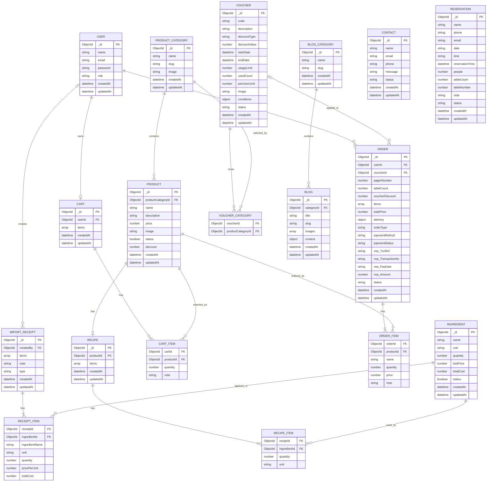

# ERD tổng quát backend

Tài liệu này được tổng hợp lại từ các schema trong `backend/model`. Hệ thống dùng MongoDB với Mongoose nên các thực thể như `CART_ITEM`, `ORDER_ITEM`, `RECIPE_ITEM`, `RECEIPT_ITEM` và `VOUCHER_CATEGORY` là thực thể logic để biểu diễn mảng nhúng hoặc mảng ObjectId trong ERD, không phải collection riêng.

## 1. ERD tổng quát



## 2. Collection thật trong MongoDB

Các collection thật tương ứng với model hiện tại:

- `users`
- `productcategories`
- `products`
- `ingredients`
- `recipes`
- `carts`
- `orders`
- `importreceipts`
- `vouchers`
- `blogcategories`
- `blogs`
- `contacts`
- `reservations`

## 3. Thực thể logic khi vẽ ERD

Các thực thể dưới đây không phải collection riêng, mà là dữ liệu nhúng hoặc mảng tham chiếu:

- `CART_ITEM`: nhúng trong `Cart.items`.
- `ORDER_ITEM`: nhúng trong `Order.items`.
- `RECIPE_ITEM`: nhúng trong `Recipe.items`.
- `RECEIPT_ITEM`: nhúng trong `ImportReceipt.items`.
- `VOUCHER_CATEGORY`: biểu diễn `Voucher.conditions.applicableCategories`.

Khi vẽ theo ERD logic, các thực thể nhúng được bổ sung khóa cha như `cartId`, `orderId`, `recipeId`, `receiptId`, `voucherId` để thể hiện quan hệ rõ ràng. Trong MongoDB hiện tại, các khóa cha này không lưu trong từng item vì item đã nằm bên trong document cha.

## 4. Phân tích mối quan hệ

### 4.1. Quan hệ có khóa ngoại thật trong schema

Các quan hệ dưới đây có field `ObjectId` và `ref` trong code, nên có thể vẽ như quan hệ chính trong ERD:

- `User` - `Cart`: quan hệ `1 - 0..1`. `Cart.userId` tham chiếu `User._id` và có `unique: true`, nên một user có tối đa một giỏ hàng.
- `User` - `Order`: quan hệ `1 - N`. `Order.userId` tham chiếu `User._id`, mỗi đơn thuộc một user.
- `User` - `ImportReceipt`: quan hệ `0..1 - N`. `ImportReceipt.createdBy` tham chiếu `User._id`, nhưng có thể `null`.
- `ProductCategory` - `Product`: quan hệ `1 - N`. `Product.productCategoryId` tham chiếu `ProductCategory._id`.
- `Product` - `Recipe`: quan hệ `1 - 0..1`. `Recipe.productId` tham chiếu `Product._id` và có `unique: true`, nên một sản phẩm có tối đa một công thức.
- `Voucher` - `Order`: quan hệ `1 - N` theo phía voucher, nhưng `Order.voucherId` có thể `null`, nên một đơn có thể không dùng voucher.
- `BlogCategory` - `Blog`: quan hệ `1 - N`. `Blog.categoryId` tham chiếu `BlogCategory._id`.

### 4.2. Quan hệ qua mảng nhúng

Các quan hệ dưới đây không có collection trung gian riêng. Chúng được lưu dưới dạng mảng nhúng trong MongoDB, nhưng khi vẽ ERD logic có thể tách thành thực thể con để dễ hiểu:

- `Cart` - `CartItem`: quan hệ `1 - N`. `Cart.items` là mảng nhúng.
- `CartItem` - `Product`: mỗi dòng giỏ hàng có `productId` tham chiếu `Product._id`.
- `Order` - `OrderItem`: quan hệ `1 - N`. `Order.items` là mảng nhúng.
- `OrderItem` - `Product`: mỗi dòng đơn hàng có `productId` tham chiếu `Product._id`, đồng thời lưu snapshot `name`, `price`, `quantity`.
- `Recipe` - `RecipeItem`: quan hệ `1 - N`. `Recipe.items` là mảng nhúng.
- `RecipeItem` - `Ingredient`: mỗi dòng công thức có `ingredientId` tham chiếu `Ingredient._id`.
- `ImportReceipt` - `ReceiptItem`: quan hệ `1 - N`. `ImportReceipt.items` là mảng nhúng.
- `ReceiptItem` - `Ingredient`: mỗi dòng phiếu kho có `ingredientId` tham chiếu `Ingredient._id`.
- `Voucher` - `VoucherCategory`: `Voucher.conditions.applicableCategories` là mảng `ObjectId`.
- `VoucherCategory` - `ProductCategory`: mỗi phần tử trong `applicableCategories` tham chiếu `ProductCategory._id`.

### 4.3. Các thực thể độc lập

Các collection dưới đây không có khóa ngoại trực tiếp tới collection khác trong schema hiện tại:

- `Contact`: lưu phản hồi/liên hệ khách hàng.
- `Reservation`: lưu yêu cầu đặt bàn online, không tham chiếu `User` hoặc `Order`.

## 5. Ghi chú về Reservation và Order

`Reservation` và `Order` không có khóa ngoại trực tiếp trong code, nên không nên nối bằng quan hệ FK trong ERD vật lý.

Tuy nhiên, hai collection này có quan hệ nghiệp vụ:

```txt
Reservation giữ trước số lượng bàn cho khách online theo khung giờ.
Order OFFLINE phản ánh số lượng bàn đang được sử dụng thực tế tại quán.
Tổng số bàn từ hai luồng này được dùng để kiểm soát sức chứa tối đa 24 bàn.
```

Nếu cần biểu diễn trên ERD nghiệp vụ, có thể dùng đường nét đứt hoặc ghi chú:

```txt
RESERVATION .. ORDER : cùng tác động đến số bàn khả dụng
```

## 6. Kiểu dữ liệu ID

Trong code hiện tại, các khóa chính và khóa ngoại dùng `ObjectId`:

- `_id` của các collection là `ObjectId`.
- `userId`, `productCategoryId`, `productId`, `ingredientId`, `voucherId`, `categoryId`, `createdBy` là `ObjectId`.

Các mã nghiệp vụ không phải `ObjectId`:

- `pagerNumber`: `number`.
- `tableCount`: `number`.
- `vnp_TxnRef`, `vnp_TransactionNo`, `vnp_PayDate`: `string`.
- `code`, `slug`, `email`: `string`.
