# Đặc tả các chức năng còn lại

Tài liệu này được viết theo code hiện tại của project CoffeeGo/Three Star. Các API chính được đọc từ `backend/router`, `backend/controllers`, `backend/model` và các page/modal trong `frontend/src/page`, `frontend/src/components/modal`.

## 3.3.7. Chức năng đăng ký tài khoản

### Biểu đồ UseCase chức năng đăng ký tài khoản

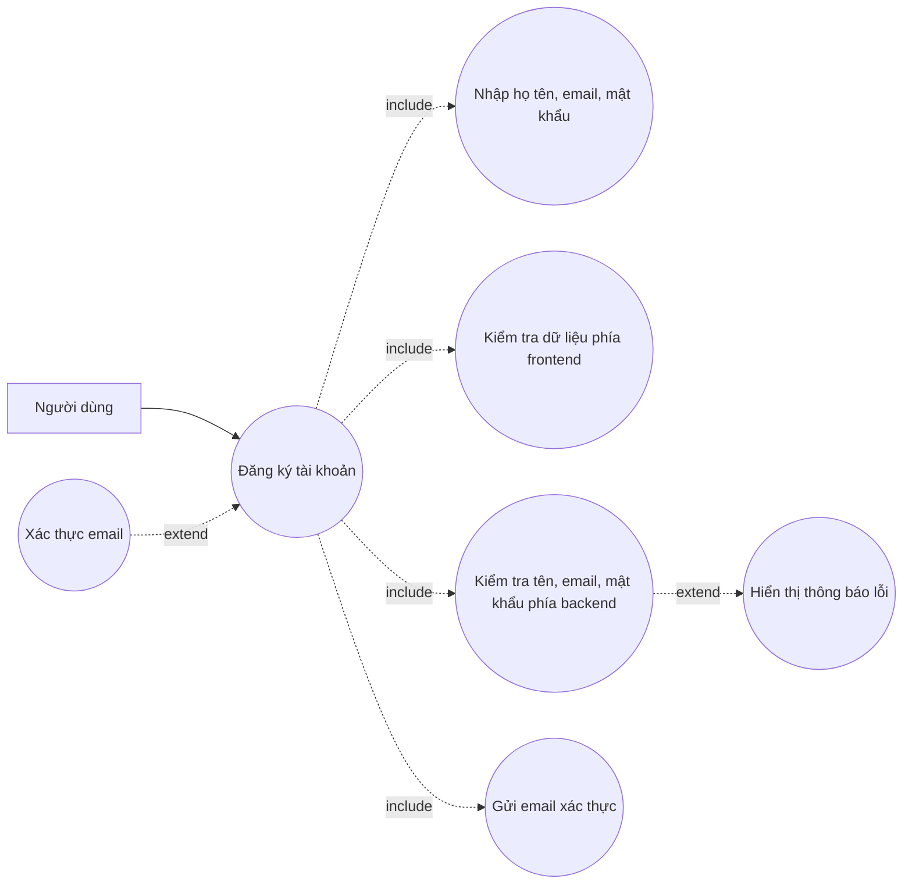
```mermaid
flowchart LR
  User[Người dùng] --> UC((Đăng ký tài khoản))
  UC -. include .-> Nhap((Nhập họ tên, email, mật khẩu))
  UC -. include .-> KiemTraFE((Kiểm tra dữ liệu phía frontend))
  UC -. include .-> KiemTraBE((Kiểm tra tên, email, mật khẩu phía backend))
  UC -. include .-> GuiMail((Gửi email xác thực))
  XacThuc((Xác thực email)) -. extend .-> UC
  KiemTraBE -. extend .-> Loi((Hiển thị thông báo lỗi))
```

### Bảng đặc tả UseCase đăng ký tài khoản

| UC | Đăng ký tài khoản |
|---|---|
| Tác nhân | Người dùng chưa có tài khoản |
| Mô tả | Người dùng nhập họ tên, email và mật khẩu. Hệ thống kiểm tra dữ liệu, kiểm tra email đã tồn tại hay chưa, sinh token xác thực và gửi email xác thực. Khi người dùng mở link xác thực, backend tạo tài khoản mới với mật khẩu đã mã hóa. |
| Tiền điều kiện | Người dùng chưa đăng nhập; email chưa tồn tại trong hệ thống. |
| Hậu điều kiện thành công | Email xác thực được gửi; sau khi xác thực email, tài khoản được tạo với vai trò mặc định `customer`. |
| Hậu điều kiện lỗi | Hệ thống hiển thị lỗi nếu thiếu dữ liệu, tên không hợp lệ, email không hợp lệ, mật khẩu dưới 8 ký tự, email đã được sử dụng, token xác thực không hợp lệ hoặc hết hạn. |

### Đặc tả chức năng

| Luồng | Nội dung |
|---|---|
| Luồng chính | 1. Người dùng mở trang đăng ký. |
|  | 2. Frontend hiển thị form nhập họ tên, email, mật khẩu. |
|  | 3. Người dùng nhập thông tin và nhấn Đăng ký. |
|  | 4. Frontend kiểm tra họ tên, email, mật khẩu không được để trống. |
|  | 5. Frontend gọi `POST /auth/register`. |
|  | 6. Backend kiểm tra tên không chứa số/ký tự đặc biệt. |
|  | 7. Backend kiểm tra định dạng email và mật khẩu tối thiểu 8 ký tự. |
|  | 8. Backend kiểm tra email đã tồn tại trong MongoDB. |
|  | 9. Backend sinh token xác thực hạn 15 phút và gửi email bằng Nodemailer. |
|  | 10. Frontend hiển thị thông báo yêu cầu kiểm tra email. |
|  | 11. Người dùng bấm link xác thực `GET /auth/verify-email?token=...`. |
|  | 12. Backend xác thực token, hash mật khẩu bằng bcrypt và tạo user. |
| Luồng phụ | 1. Nếu thiếu họ tên/email/mật khẩu, frontend hiển thị lỗi. |
|  | 2. Nếu tên, email hoặc mật khẩu không hợp lệ, backend trả lỗi. |
|  | 3. Nếu email đã tồn tại, backend trả lỗi `Email đã được sử dụng`. |
|  | 4. Nếu token xác thực không hợp lệ/hết hạn, backend trả lỗi. |

### Biểu đồ hoạt động chức năng đăng ký tài khoản

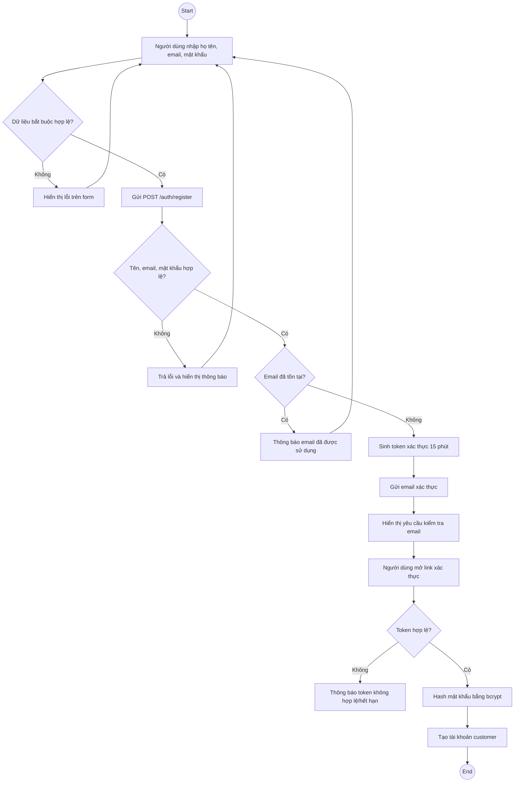
```mermaid
flowchart TB
  Start((Start)) --> Nhap[Người dùng nhập họ tên, email, mật khẩu]
  Nhap --> CheckFE{Dữ liệu bắt buộc hợp lệ?}
  CheckFE -- Không --> LoiFE[Hiển thị lỗi trên form] --> Nhap
  CheckFE -- Có --> GuiBE[Gửi POST /auth/register]
  GuiBE --> CheckBE{Tên, email, mật khẩu hợp lệ?}
  CheckBE -- Không --> LoiBE[Trả lỗi và hiển thị thông báo] --> Nhap
  CheckBE -- Có --> CheckEmail{Email đã tồn tại?}
  CheckEmail -- Có --> LoiEmail[Thông báo email đã được sử dụng] --> Nhap
  CheckEmail -- Không --> TaoToken[Sinh token xác thực 15 phút]
  TaoToken --> GuiMail[Gửi email xác thực]
  GuiMail --> ChoXacThuc[Hiển thị yêu cầu kiểm tra email]
  ChoXacThuc --> MoLink[Người dùng mở link xác thực]
  MoLink --> TokenOK{Token hợp lệ?}
  TokenOK -- Không --> LoiToken[Thông báo token không hợp lệ/hết hạn]
  TokenOK -- Có --> Hash[Hash mật khẩu bằng bcrypt]
  Hash --> TaoUser[Tạo tài khoản customer]
  TaoUser --> End((End))
```

### Biểu đồ tuần tự chức năng đăng ký tài khoản

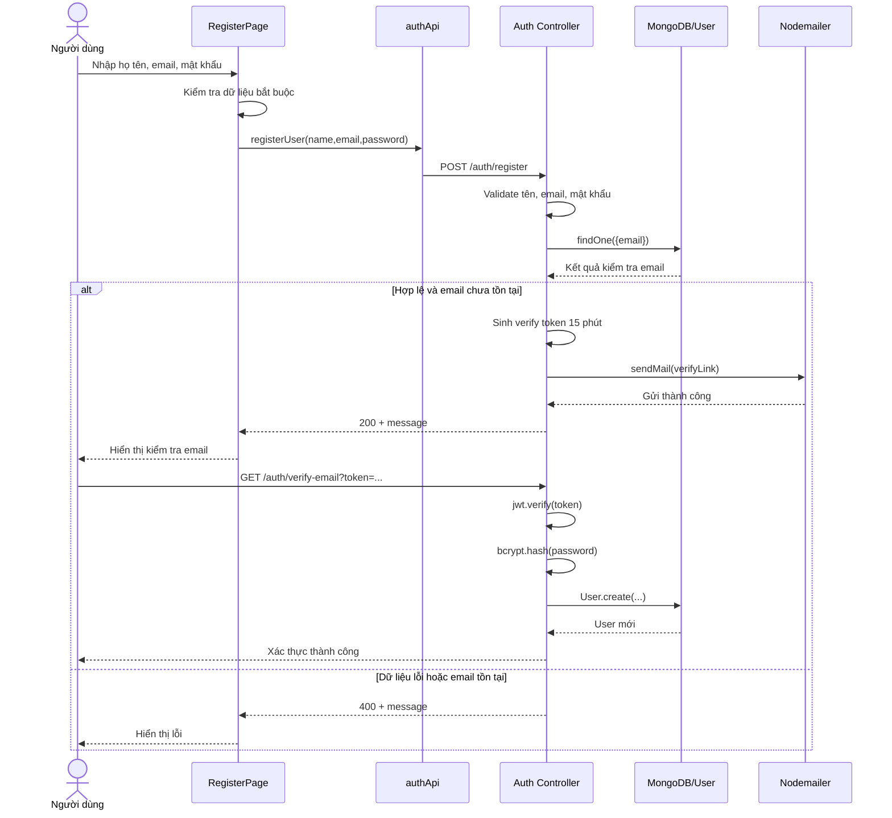
```mermaid
sequenceDiagram
  actor User as Người dùng
  participant FE as RegisterPage
  participant AuthAPI as authApi
  participant Auth as Auth Controller
  participant DB as MongoDB/User
  participant Mail as Nodemailer
  User->>FE: Nhập họ tên, email, mật khẩu
  FE->>FE: Kiểm tra dữ liệu bắt buộc
  FE->>AuthAPI: registerUser(name,email,password)
  AuthAPI->>Auth: POST /auth/register
  Auth->>Auth: Validate tên, email, mật khẩu
  Auth->>DB: findOne({email})
  DB-->>Auth: Kết quả kiểm tra email
  alt Hợp lệ và email chưa tồn tại
    Auth->>Auth: Sinh verify token 15 phút
    Auth->>Mail: sendMail(verifyLink)
    Mail-->>Auth: Gửi thành công
    Auth-->>FE: 200 + message
    FE-->>User: Hiển thị kiểm tra email
    User->>Auth: GET /auth/verify-email?token=...
    Auth->>Auth: jwt.verify(token)
    Auth->>Auth: bcrypt.hash(password)
    Auth->>DB: User.create(...)
    DB-->>Auth: User mới
    Auth-->>User: Xác thực thành công
  else Dữ liệu lỗi hoặc email tồn tại
    Auth-->>FE: 400 + message
    FE-->>User: Hiển thị lỗi
  end
```

## 3.3.8. Chức năng quản lý công thức

### Biểu đồ UseCase chức năng quản lý công thức

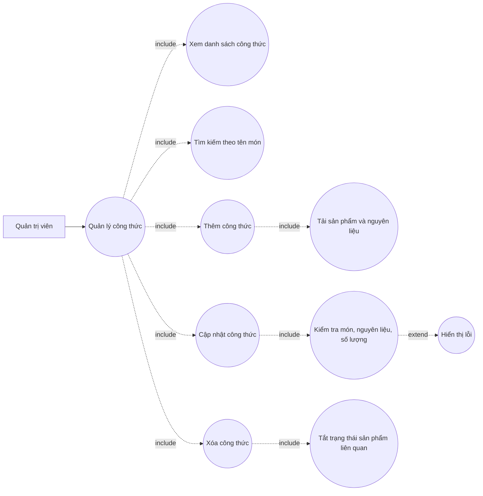
```mermaid
flowchart LR
  Admin[Quản trị viên] --> UC((Quản lý công thức))
  UC -. include .-> Xem((Xem danh sách công thức))
  UC -. include .-> Tim((Tìm kiếm theo tên món))
  UC -. include .-> Them((Thêm công thức))
  UC -. include .-> Sua((Cập nhật công thức))
  UC -. include .-> Xoa((Xóa công thức))
  Them -. include .-> LoadData((Tải sản phẩm và nguyên liệu))
  Sua -. include .-> Validate((Kiểm tra món, nguyên liệu, số lượng))
  Xoa -. include .-> TatSP((Tắt trạng thái sản phẩm liên quan))
  Validate -. extend .-> Loi((Hiển thị lỗi))
```

### Bảng đặc tả UseCase quản lý công thức

| UC | Quản lý công thức |
|---|---|
| Tác nhân | Quản trị viên |
| Mô tả | Admin xem danh sách công thức, tìm theo tên món, thêm công thức cho sản phẩm, cập nhật nguyên liệu/số lượng và xóa công thức. Khi xóa công thức, backend đồng thời cập nhật sản phẩm liên quan về trạng thái ngừng bán. |
| Tiền điều kiện | Admin đã đăng nhập; request có token hợp lệ và qua middleware `isAdmin`; hệ thống có dữ liệu sản phẩm/nguyên liệu khi thêm hoặc sửa. |
| Hậu điều kiện thành công | Công thức được tạo/cập nhật/xóa trong MongoDB; danh sách frontend được cập nhật; nếu xóa thì sản phẩm liên quan bị đặt `status: false`. |
| Hậu điều kiện lỗi | Hiển thị lỗi nếu thiếu dữ liệu, công thức của món đã tồn tại, số lượng nguyên liệu nhỏ hơn 1, nguyên liệu trùng, không tìm thấy công thức hoặc không đủ quyền. |

### Đặc tả chức năng

| Luồng | Nội dung |
|---|---|
| Luồng chính | 1. Admin mở trang Quản lý công thức. |
|  | 2. Frontend gọi `GET /recipes` để tải danh sách công thức. |
|  | 3. Admin tìm kiếm theo tên món nếu cần. |
|  | 4. Admin chọn thêm hoặc sửa công thức. |
|  | 5. Modal tải danh sách nguyên liệu và sản phẩm. |
|  | 6. Admin chọn món, chọn các nguyên liệu, nhập số lượng. |
|  | 7. Frontend kiểm tra món, nguyên liệu, số lượng và nguyên liệu trùng. |
|  | 8. Frontend gọi `POST /recipes` hoặc `PUT /recipes/:id`. |
|  | 9. Backend kiểm tra dữ liệu, kiểm tra công thức trùng theo `productId`. |
|  | 10. Backend lưu công thức và populate tên món, tên nguyên liệu để trả về. |
|  | 11. Frontend cập nhật danh sách và hiển thị thông báo thành công. |
| Luồng xóa | 1. Admin bấm xóa và xác nhận. |
|  | 2. Frontend gọi `DELETE /recipes/:id`. |
|  | 3. Backend xóa công thức. |
|  | 4. Backend cập nhật sản phẩm liên quan `status: false`. |
| Luồng phụ | 1. Nếu công thức cho món đã tồn tại, backend trả lỗi. |
|  | 2. Nếu số lượng nguyên liệu nhỏ hơn 1 hoặc nguyên liệu trùng, frontend/backend trả lỗi. |
|  | 3. Nếu không tìm thấy công thức, backend trả lỗi 404. |

### Biểu đồ hoạt động chức năng quản lý công thức

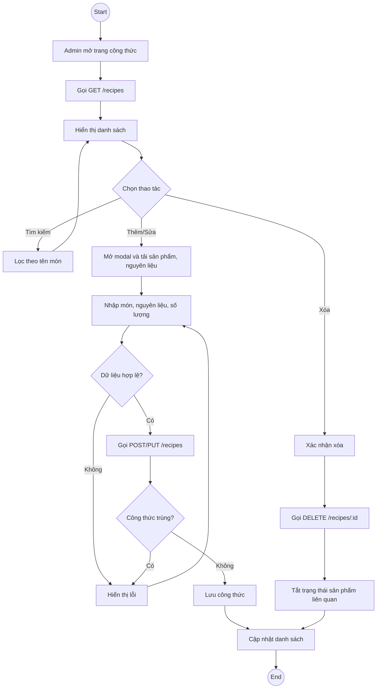
```mermaid
flowchart TB
  Start((Start)) --> Open[Admin mở trang công thức]
  Open --> Load[Gọi GET /recipes]
  Load --> List[Hiển thị danh sách]
  List --> Action{Chọn thao tác}
  Action -- Tìm kiếm --> Search[Lọc theo tên món] --> List
  Action -- Thêm/Sửa --> Modal[Mở modal và tải sản phẩm, nguyên liệu]
  Modal --> Input[Nhập món, nguyên liệu, số lượng]
  Input --> Check{Dữ liệu hợp lệ?}
  Check -- Không --> Error[Hiển thị lỗi] --> Input
  Check -- Có --> Save[Gọi POST/PUT /recipes]
  Save --> Dup{Công thức trùng?}
  Dup -- Có --> Error
  Dup -- Không --> Persist[Lưu công thức]
  Persist --> UpdateList[Cập nhật danh sách]
  Action -- Xóa --> Confirm[Xác nhận xóa]
  Confirm --> Delete[Gọi DELETE /recipes/:id]
  Delete --> DisableProduct[Tắt trạng thái sản phẩm liên quan]
  DisableProduct --> UpdateList
  UpdateList --> End((End))
```

### Biểu đồ tuần tự chức năng quản lý công thức

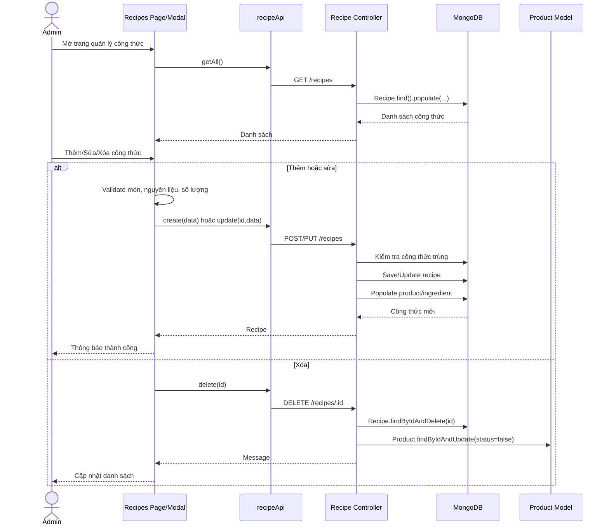
```mermaid
sequenceDiagram
  actor Admin as Admin
  participant FE as Recipes Page/Modal
  participant API as recipeApi
  participant RecipeCtrl as Recipe Controller
  participant DB as MongoDB
  participant Product as Product Model
  Admin->>FE: Mở trang quản lý công thức
  FE->>API: getAll()
  API->>RecipeCtrl: GET /recipes
  RecipeCtrl->>DB: Recipe.find().populate(...)
  DB-->>RecipeCtrl: Danh sách công thức
  RecipeCtrl-->>FE: Danh sách
  Admin->>FE: Thêm/Sửa/Xóa công thức
  alt Thêm hoặc sửa
    FE->>FE: Validate món, nguyên liệu, số lượng
    FE->>API: create(data) hoặc update(id,data)
    API->>RecipeCtrl: POST/PUT /recipes
    RecipeCtrl->>DB: Kiểm tra công thức trùng
    RecipeCtrl->>DB: Save/Update recipe
    RecipeCtrl->>DB: Populate product/ingredient
    DB-->>RecipeCtrl: Công thức mới
    RecipeCtrl-->>FE: Recipe
    FE-->>Admin: Thông báo thành công
  else Xóa
    FE->>API: delete(id)
    API->>RecipeCtrl: DELETE /recipes/:id
    RecipeCtrl->>DB: Recipe.findByIdAndDelete(id)
    RecipeCtrl->>Product: Product.findByIdAndUpdate(status=false)
    RecipeCtrl-->>FE: Message
    FE-->>Admin: Cập nhật danh sách
  end
```

## 3.3.9. Chức năng tạo đơn offline

### Biểu đồ UseCase chức năng tạo đơn offline

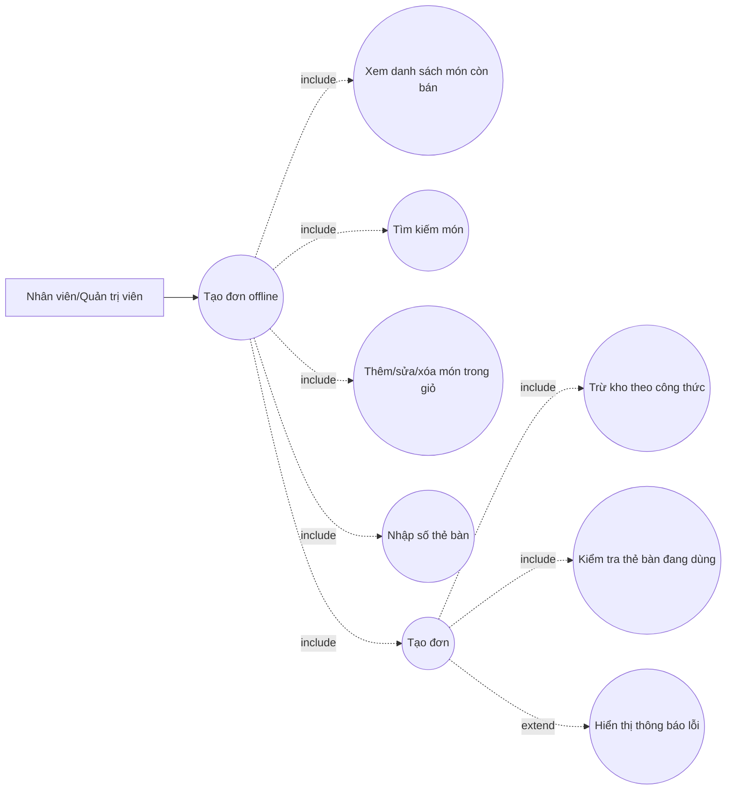
```mermaid
flowchart LR
  Staff[Nhân viên/Quản trị viên] --> UC((Tạo đơn offline))
  UC -. include .-> XemMon((Xem danh sách món còn bán))
  UC -. include .-> TimMon((Tìm kiếm món))
  UC -. include .-> GioHang((Thêm/sửa/xóa món trong giỏ))
  UC -. include .-> NhapThe((Nhập số thẻ bàn))
  UC -. include .-> TaoDon((Tạo đơn))
  TaoDon -. include .-> TruKho((Trừ kho theo công thức))
  TaoDon -. include .-> KiemTraThe((Kiểm tra thẻ bàn đang dùng))
  TaoDon -. extend .-> Loi((Hiển thị thông báo lỗi))
```

### Bảng đặc tả UseCase tạo đơn offline

| UC | Tạo đơn offline |
|---|---|
| Tác nhân | Nhân viên, quản trị viên |
| Mô tả | Nhân viên/admin chọn món còn bán, thêm vào giỏ, nhập số thẻ bàn và tạo đơn offline. Backend kiểm tra thẻ bàn chưa có đơn đang xử lý, tính tiền theo giá/giảm giá sản phẩm, kiểm tra công thức, trừ kho nguyên liệu trong transaction và tạo đơn thanh toán tiền mặt. |
| Tiền điều kiện | Người dùng đã đăng nhập với vai trò admin hoặc manager; sản phẩm còn bán; sản phẩm có công thức; kho đủ nguyên liệu. |
| Hậu điều kiện thành công | Đơn `OFFLINE` được tạo với `paymentMethod: CASH`, `paymentStatus: SUCCESS`, `status: PROCESSING`; nguyên liệu bị trừ theo công thức. |
| Hậu điều kiện lỗi | Không tạo đơn nếu chưa nhập thẻ, thẻ <= 0, giỏ hàng trống, chưa đăng nhập, thẻ đang được dùng, sản phẩm ngừng bán, sản phẩm chưa có công thức hoặc kho không đủ nguyên liệu. |

### Đặc tả chức năng

| Luồng | Nội dung |
|---|---|
| Luồng chính | 1. Nhân viên/admin mở trang gọi món offline. |
|  | 2. Frontend gọi API lấy danh sách sản phẩm và chỉ hiển thị sản phẩm `status === true`. |
|  | 3. Nhân viên tìm món, bấm món để thêm vào giỏ. |
|  | 4. Nhân viên tăng/giảm số lượng, xóa món hoặc nhập ghi chú. |
|  | 5. Nhân viên nhập số thẻ bàn. |
|  | 6. Frontend kiểm tra số thẻ hợp lệ, giỏ hàng không trống và user đã đăng nhập. |
|  | 7. Frontend gửi `POST /orders` với `userId`, `items`, `pagerNumber`. |
|  | 8. Backend mở MongoDB transaction. |
|  | 9. Backend kiểm tra thẻ bàn chưa có đơn `PROCESSING`. |
|  | 10. Backend tính tổng tiền theo giá sản phẩm sau discount. |
|  | 11. Backend tìm công thức từng món, trừ kho nguyên liệu bằng `$inc`. |
|  | 12. Backend tạo order offline và commit transaction. |
|  | 13. Frontend xóa giỏ, xóa số thẻ và thông báo thành công. |
| Luồng phụ | 1. Nếu thẻ bàn đang dùng, backend abort transaction và báo lỗi. |
|  | 2. Nếu sản phẩm ngừng bán hoặc chưa có công thức, backend abort transaction. |
|  | 3. Nếu kho không đủ nguyên liệu, backend abort transaction. |

### Biểu đồ hoạt động chức năng tạo đơn offline

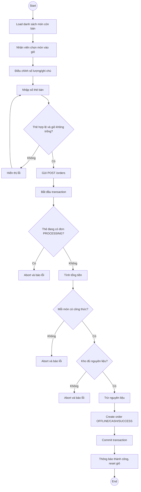
```mermaid
flowchart TB
  Start((Start)) --> Load[Load danh sách món còn bán]
  Load --> Select[Nhân viên chọn món vào giỏ]
  Select --> Cart[Điều chỉnh số lượng/ghi chú]
  Cart --> Pager[Nhập số thẻ bàn]
  Pager --> CheckFE{Thẻ hợp lệ và giỏ không trống?}
  CheckFE -- Không --> ErrFE[Hiển thị lỗi] --> Pager
  CheckFE -- Có --> Send[Gửi POST /orders]
  Send --> Tx[Bắt đầu transaction]
  Tx --> CheckPager{Thẻ đang có đơn PROCESSING?}
  CheckPager -- Có --> Abort1[Abort và báo lỗi]
  CheckPager -- Không --> Price[Tính tổng tiền]
  Price --> CheckRecipe{Mỗi món có công thức?}
  CheckRecipe -- Không --> Abort2[Abort và báo lỗi]
  CheckRecipe -- Có --> CheckStock{Kho đủ nguyên liệu?}
  CheckStock -- Không --> Abort3[Abort và báo lỗi]
  CheckStock -- Có --> Decrease[Trừ nguyên liệu]
  Decrease --> Create[Create order OFFLINE/CASH/SUCCESS]
  Create --> Commit[Commit transaction]
  Commit --> Success[Thông báo thành công, reset giỏ]
  Success --> End((End))
```

### Biểu đồ tuần tự chức năng tạo đơn offline

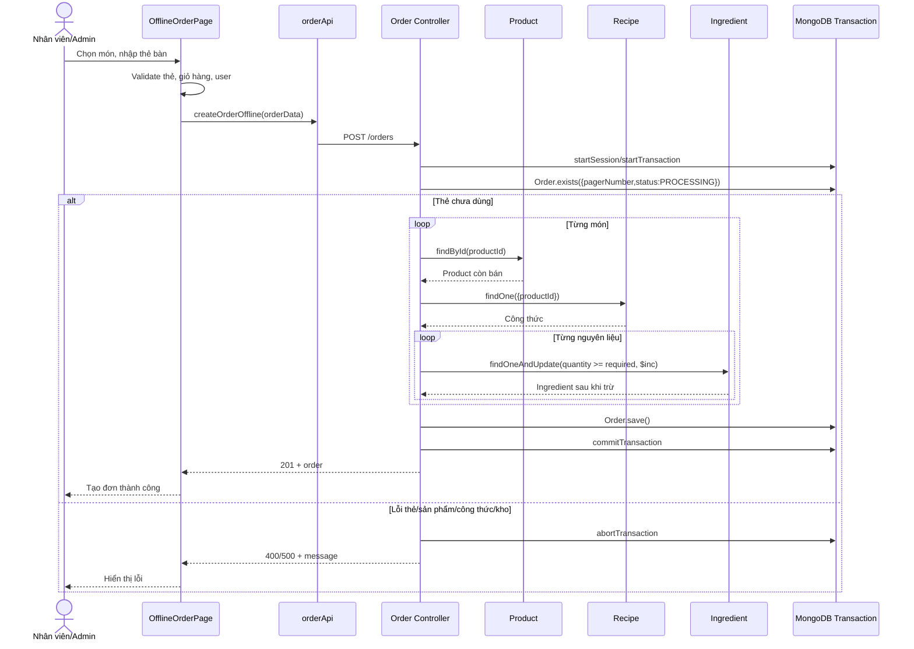
```mermaid
sequenceDiagram
  actor Staff as Nhân viên/Admin
  participant FE as OfflineOrderPage
  participant OrderAPI as orderApi
  participant OrderCtrl as Order Controller
  participant Product as Product
  participant Recipe as Recipe
  participant Ingredient as Ingredient
  participant DB as MongoDB Transaction
  Staff->>FE: Chọn món, nhập thẻ bàn
  FE->>FE: Validate thẻ, giỏ hàng, user
  FE->>OrderAPI: createOrderOffline(orderData)
  OrderAPI->>OrderCtrl: POST /orders
  OrderCtrl->>DB: startSession/startTransaction
  OrderCtrl->>DB: Order.exists({pagerNumber,status:PROCESSING})
  alt Thẻ chưa dùng
    loop Từng món
      OrderCtrl->>Product: findById(productId)
      Product-->>OrderCtrl: Product còn bán
      OrderCtrl->>Recipe: findOne({productId})
      Recipe-->>OrderCtrl: Công thức
      loop Từng nguyên liệu
        OrderCtrl->>Ingredient: findOneAndUpdate(quantity >= required, $inc)
        Ingredient-->>OrderCtrl: Ingredient sau khi trừ
      end
    end
    OrderCtrl->>DB: Order.save()
    OrderCtrl->>DB: commitTransaction
    OrderCtrl-->>FE: 201 + order
    FE-->>Staff: Tạo đơn thành công
  else Lỗi thẻ/sản phẩm/công thức/kho
    OrderCtrl->>DB: abortTransaction
    OrderCtrl-->>FE: 400/500 + message
    FE-->>Staff: Hiển thị lỗi
  end
```

## 3.3.10. Chức năng quản lý voucher

### Biểu đồ UseCase chức năng quản lý voucher

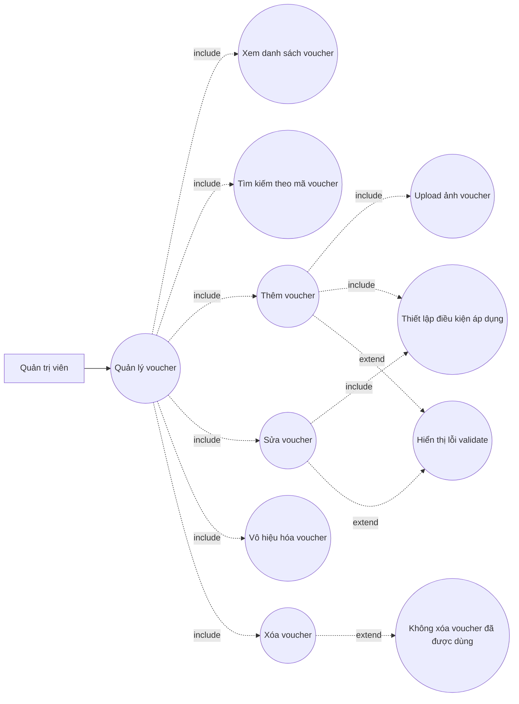
```mermaid
flowchart LR
  Admin[Quản trị viên] --> UC((Quản lý voucher))
  UC -. include .-> Xem((Xem danh sách voucher))
  UC -. include .-> Tim((Tìm kiếm theo mã voucher))
  UC -. include .-> Them((Thêm voucher))
  UC -. include .-> Sua((Sửa voucher))
  UC -. include .-> VoHieu((Vô hiệu hóa voucher))
  UC -. include .-> Xoa((Xóa voucher))
  Them -. include .-> Upload((Upload ảnh voucher))
  Them -. include .-> DieuKien((Thiết lập điều kiện áp dụng))
  Sua -. include .-> DieuKien
  Sua -. extend .-> Loi((Hiển thị lỗi validate))
  Xoa -. extend .-> ChanXoa((Không xóa voucher đã được dùng))
  Them -. extend .-> Loi
```

### Bảng đặc tả UseCase quản lý voucher

| UC | Quản lý voucher |
|---|---|
| Tác nhân | Quản trị viên |
| Mô tả | Admin xem danh sách voucher, tìm theo mã, tạo voucher mới, sửa thông tin voucher với loại giảm tiền/phần trăm, thời gian áp dụng, ảnh, giới hạn lượt dùng và điều kiện đơn hàng; admin có thể vô hiệu hóa hoặc xóa voucher chưa được sử dụng. |
| Tiền điều kiện | Admin đã đăng nhập; có token hợp lệ; khi tạo/sửa voucher cần ảnh và dữ liệu bắt buộc. |
| Hậu điều kiện thành công | Voucher được tạo, cập nhật, vô hiệu hóa hoặc xóa; danh sách frontend được cập nhật. Trạng thái hiển thị được tính theo thời gian: `upcoming`, `active`, `expired`, hoặc `inactive`. |
| Hậu điều kiện lỗi | Hiển thị lỗi nếu mã trùng, mã sai định dạng, thiếu dữ liệu, giá trị giảm không hợp lệ, thời gian kết thúc không hợp lệ, số lượt dùng sai hoặc voucher đã được sử dụng nên không thể xóa. |

### Đặc tả chức năng

| Luồng | Nội dung |
|---|---|
| Luồng chính | 1. Admin mở trang Quản lý voucher. |
|  | 2. Frontend gọi `GET /vouchers` và hiển thị danh sách. |
|  | 3. Admin tìm kiếm voucher theo mã nếu cần. |
|  | 4. Admin bấm thêm voucher. |
|  | 5. Modal tải danh mục sản phẩm để chọn điều kiện áp dụng. |
|  | 6. Admin nhập mã, mô tả, loại giảm, giá trị giảm, thời gian, ảnh, giới hạn và điều kiện. |
|  | 7. Frontend kiểm tra dữ liệu bằng `react-hook-form`. |
|  | 8. Frontend upload ảnh, lấy URL ảnh và gọi `POST /vouchers`. |
|  | 9. Backend kiểm tra mã trùng, regex mã, số liệu, thời gian và discount. |
|  | 10. Backend tạo voucher và populate danh mục áp dụng. |
|  | 11. Frontend thêm voucher vào danh sách và thông báo thành công. |
| Luồng sửa | 1. Admin chọn biểu tượng sửa ở một voucher. |
|  | 2. Frontend mở modal cập nhật với dữ liệu voucher hiện tại. |
|  | 3. Admin chỉnh mã, mô tả, loại giảm, giá trị giảm, thời gian, ảnh, giới hạn hoặc điều kiện áp dụng. |
|  | 4. Nếu admin không chọn ảnh mới, frontend giữ ảnh cũ. |
|  | 5. Frontend gọi `PUT /vouchers/:id`. |
|  | 6. Backend kiểm tra voucher tồn tại, mã không trùng voucher khác, thời gian/giá trị hợp lệ và `usageLimit` không nhỏ hơn `usedCount`. |
|  | 7. Backend cập nhật voucher, populate danh mục áp dụng và trả dữ liệu mới. |
|  | 8. Frontend cập nhật voucher trong danh sách và thông báo thành công. |
| Luồng vô hiệu hóa | 1. Admin chọn vô hiệu hóa voucher. |
|  | 2. Frontend gọi `PATCH /vouchers/deactivateVoucher/:id`. |
|  | 3. Backend đặt `status = inactive`. |
| Luồng xóa | 1. Admin chọn xóa voucher và xác nhận. |
|  | 2. Frontend gọi `DELETE /vouchers/deleteVoucher/:id`. |
|  | 3. Backend chỉ xóa nếu `usedCount === 0`. |
| Luồng phụ | 1. Nếu mã đã tồn tại hoặc sai định dạng, backend trả lỗi. |
|  | 2. Nếu voucher đã inactive, backend không cho vô hiệu hóa lại. |
|  | 3. Nếu voucher đã có lượt dùng, backend không cho xóa. |

### Biểu đồ hoạt động chức năng quản lý voucher

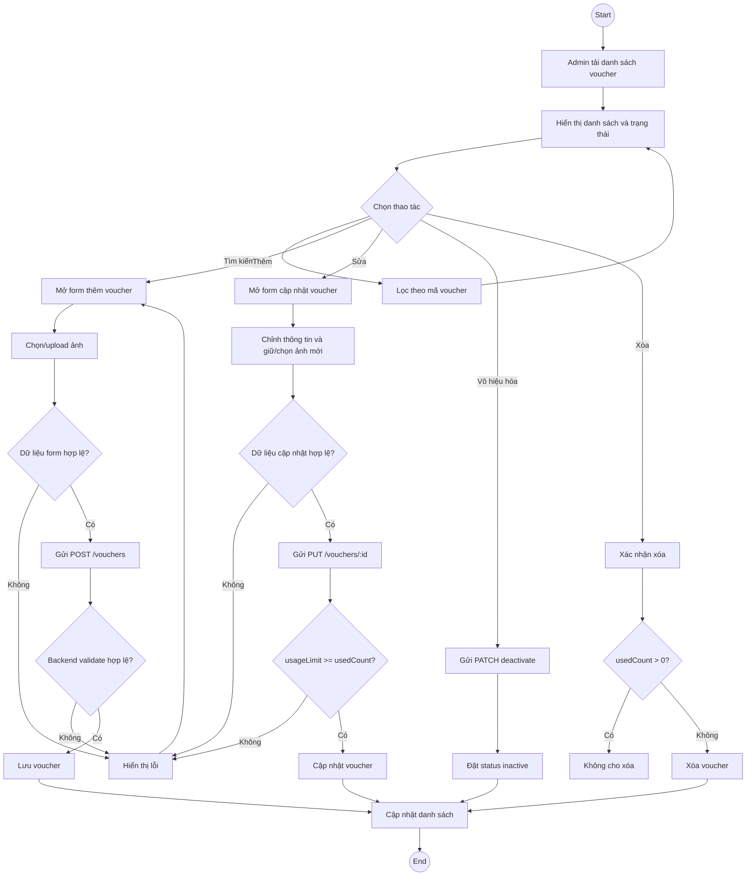
```mermaid
flowchart TB
  Start((Start)) --> Load[Admin tải danh sách voucher]
  Load --> List[Hiển thị danh sách và trạng thái]
  List --> Action{Chọn thao tác}
  Action -- Tìm kiếm --> Search[Lọc theo mã voucher] --> List
  Action -- Thêm --> Form[Mở form thêm voucher]
  Form --> Upload[Chọn/upload ảnh]
  Upload --> CheckFE{Dữ liệu form hợp lệ?}
  CheckFE -- Không --> Err[Hiển thị lỗi] --> Form
  CheckFE -- Có --> Create[Gửi POST /vouchers]
  Create --> CheckBE{Backend validate hợp lệ?}
  CheckBE -- Không --> Err
  CheckBE -- Có --> Save[Lưu voucher]
  Save --> Update[Cập nhật danh sách]
  Action -- Sửa --> Edit[Mở form cập nhật voucher]
  Edit --> Change[Chỉnh thông tin và giữ/chọn ảnh mới]
  Change --> CheckEdit{Dữ liệu cập nhật hợp lệ?}
  CheckEdit -- Không --> Err
  CheckEdit -- Có --> Put[Gửi PUT /vouchers/:id]
  Put --> CheckUsed{usageLimit >= usedCount?}
  CheckUsed -- Không --> Err
  CheckUsed -- Có --> UpdateVoucher[Cập nhật voucher] --> Update
  Action -- Vô hiệu hóa --> Deactivate[Gửi PATCH deactivate]
  Deactivate --> SetInactive[Đặt status inactive] --> Update
  Action -- Xóa --> Confirm[Xác nhận xóa]
  Confirm --> Used{usedCount > 0?}
  Used -- Có --> ErrDelete[Không cho xóa]
  Used -- Không --> Delete[Xóa voucher] --> Update
  Update --> End((End))
```

### Biểu đồ tuần tự chức năng quản lý voucher

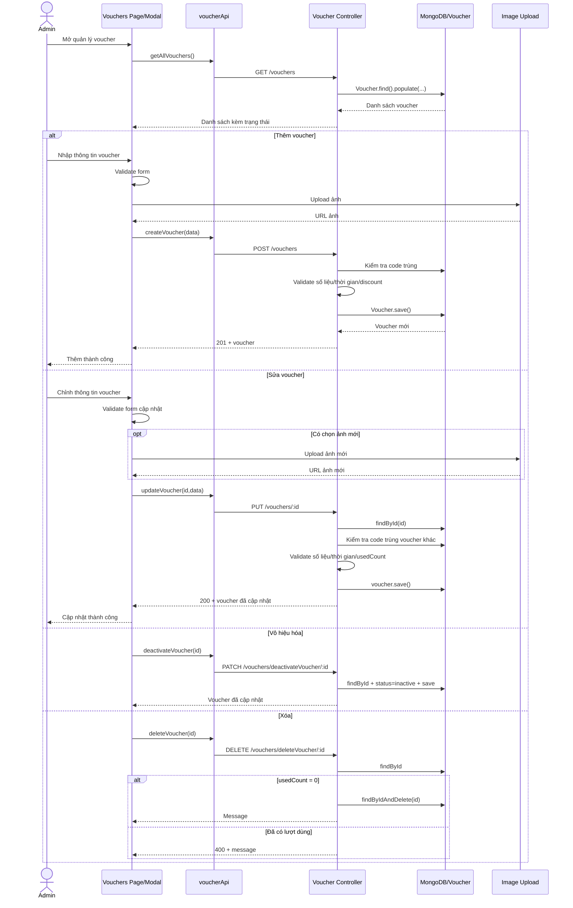
```mermaid
sequenceDiagram
  actor Admin as Admin
  participant FE as Vouchers Page/Modal
  participant API as voucherApi
  participant Ctrl as Voucher Controller
  participant DB as MongoDB/Voucher
  participant Upload as Image Upload
  Admin->>FE: Mở quản lý voucher
  FE->>API: getAllVouchers()
  API->>Ctrl: GET /vouchers
  Ctrl->>DB: Voucher.find().populate(...)
  DB-->>Ctrl: Danh sách voucher
  Ctrl-->>FE: Danh sách kèm trạng thái
  alt Thêm voucher
    Admin->>FE: Nhập thông tin voucher
    FE->>FE: Validate form
    FE->>Upload: Upload ảnh
    Upload-->>FE: URL ảnh
    FE->>API: createVoucher(data)
    API->>Ctrl: POST /vouchers
    Ctrl->>DB: Kiểm tra code trùng
    Ctrl->>Ctrl: Validate số liệu/thời gian/discount
    Ctrl->>DB: Voucher.save()
    DB-->>Ctrl: Voucher mới
    Ctrl-->>FE: 201 + voucher
    FE-->>Admin: Thêm thành công
  else Sửa voucher
    Admin->>FE: Chỉnh thông tin voucher
    FE->>FE: Validate form cập nhật
    opt Có chọn ảnh mới
      FE->>Upload: Upload ảnh mới
      Upload-->>FE: URL ảnh mới
    end
    FE->>API: updateVoucher(id,data)
    API->>Ctrl: PUT /vouchers/:id
    Ctrl->>DB: findById(id)
    Ctrl->>DB: Kiểm tra code trùng voucher khác
    Ctrl->>Ctrl: Validate số liệu/thời gian/usedCount
    Ctrl->>DB: voucher.save()
    Ctrl-->>FE: 200 + voucher đã cập nhật
    FE-->>Admin: Cập nhật thành công
  else Vô hiệu hóa
    FE->>API: deactivateVoucher(id)
    API->>Ctrl: PATCH /vouchers/deactivateVoucher/:id
    Ctrl->>DB: findById + status=inactive + save
    Ctrl-->>FE: Voucher đã cập nhật
  else Xóa
    FE->>API: deleteVoucher(id)
    API->>Ctrl: DELETE /vouchers/deleteVoucher/:id
    Ctrl->>DB: findById
    alt usedCount = 0
      Ctrl->>DB: findByIdAndDelete(id)
      Ctrl-->>FE: Message
    else Đã có lượt dùng
      Ctrl-->>FE: 400 + message
    end
  end
```

## 3.3.11. Chức năng quản lý đặt bàn

### Biểu đồ UseCase chức năng quản lý đặt bàn

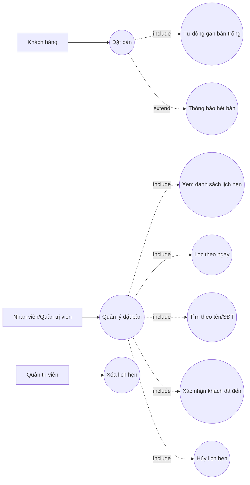
```mermaid
flowchart LR
  Customer[Khách hàng] --> DatBan((Đặt bàn))
  Staff[Nhân viên/Quản trị viên] --> QuanLy((Quản lý đặt bàn))
  QuanLy -. include .-> Xem((Xem danh sách lịch hẹn))
  QuanLy -. include .-> LocNgay((Lọc theo ngày))
  QuanLy -. include .-> Tim((Tìm theo tên/SĐT))
  QuanLy -. include .-> XacNhan((Xác nhận khách đã đến))
  QuanLy -. include .-> Huy((Hủy lịch hẹn))
  Admin[Quản trị viên] --> Xoa((Xóa lịch hẹn))
  DatBan -. include .-> GanBan((Tự động gán bàn trống))
  DatBan -. extend .-> HetBan((Thông báo hết bàn))
```

### Bảng đặc tả UseCase quản lý đặt bàn

| UC | Quản lý đặt bàn |
|---|---|
| Tác nhân | Khách hàng, nhân viên, quản trị viên |
| Mô tả | Khách hàng đặt bàn trong ngày với thông tin liên hệ, thời gian và số người. Hệ thống tự gán bàn còn trống trong 24 bàn theo khung giờ. Nhân viên/admin xem, tìm, lọc, xác nhận khách đã đến hoặc hủy lịch; admin có quyền xóa lịch đã hoàn tất hoặc đã hủy. |
| Tiền điều kiện | Khách nhập đủ thông tin đặt bàn; nhân viên/admin có token hợp lệ khi quản lý; admin mới được xóa. |
| Hậu điều kiện thành công | Lịch đặt bàn được tạo ở trạng thái `PENDING`; khi xác nhận chuyển sang `COMPLETED`; khi hủy chuyển sang `CANCELLED`; khi xóa thì bản ghi bị xóa khỏi MongoDB. |
| Hậu điều kiện lỗi | Không tạo nếu thiếu dữ liệu, thời gian không hợp lệ/quá khứ, hết bàn trong khung giờ. Không xác nhận/hủy nếu lịch không còn `PENDING`. Không xóa nếu lịch còn `PENDING`. |

### Đặc tả chức năng

| Luồng | Nội dung |
|---|---|
| Luồng khách đặt bàn | 1. Khách mở trang đặt bàn. |
|  | 2. Frontend hiển thị form họ tên, SĐT, email, ngày hiện tại, giờ, số người, ghi chú. |
|  | 3. Khách nhập thông tin và gửi form. |
|  | 4. Frontend validate họ tên, SĐT, email, số người 1-20. |
|  | 5. Frontend gọi `POST /reservations`. |
|  | 6. Backend kiểm tra dữ liệu bắt buộc và thời gian đặt không ở quá khứ. |
|  | 7. Backend tìm lịch cùng ngày/giờ có status khác `CANCELLED`. |
|  | 8. Backend gán số bàn trống từ 1 đến 24. |
|  | 9. Backend tạo lịch `PENDING` và trả số bàn. |
| Luồng admin/staff | 1. Nhân viên/admin mở trang quản lý lịch hẹn. |
|  | 2. Frontend gọi `GET /reservations?startDate&endDate`. |
|  | 3. Nhân viên/admin tìm theo tên/SĐT hoặc lọc nhanh theo ngày. |
|  | 4. Với lịch `PENDING`, nhân viên/admin xác nhận hoặc hủy. |
|  | 5. Frontend gọi `PATCH /reservations/:id/confirm` hoặc `/cancel`. |
|  | 6. Backend cập nhật trạng thái và trả lịch mới. |
|  | 7. Với lịch `COMPLETED` hoặc `CANCELLED`, admin có thể xóa bằng `DELETE /reservations/:id`. |
| Luồng phụ | 1. Nếu khung giờ đủ 24 bàn, backend báo hết bàn. |
|  | 2. Nếu lịch không ở trạng thái `PENDING`, backend không cho xác nhận/hủy. |
|  | 3. Nếu lịch còn `PENDING`, backend không cho xóa. |

### Biểu đồ hoạt động chức năng quản lý đặt bàn

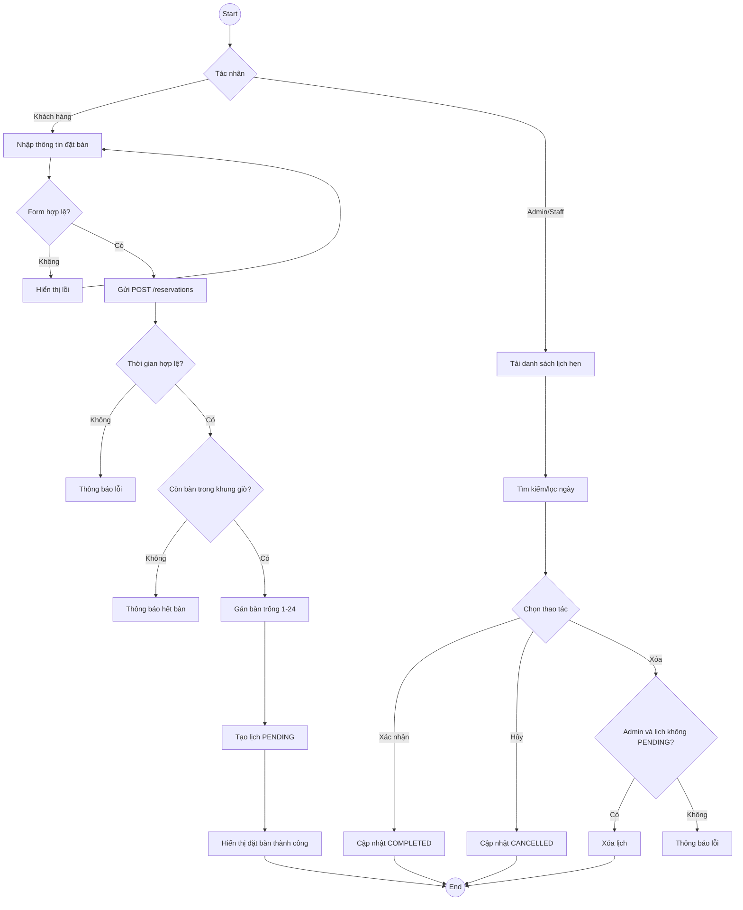
```mermaid
flowchart TB
  Start((Start)) --> Actor{Tác nhân}
  Actor -- Khách hàng --> Form[Nhập thông tin đặt bàn]
  Form --> CheckFE{Form hợp lệ?}
  CheckFE -- Không --> ErrFE[Hiển thị lỗi] --> Form
  CheckFE -- Có --> Create[Gửi POST /reservations]
  Create --> TimeOK{Thời gian hợp lệ?}
  TimeOK -- Không --> ErrBE[Thông báo lỗi]
  TimeOK -- Có --> Table{Còn bàn trong khung giờ?}
  Table -- Không --> Full[Thông báo hết bàn]
  Table -- Có --> Assign[Gán bàn trống 1-24]
  Assign --> Pending[Tạo lịch PENDING]
  Pending --> Success[Hiển thị đặt bàn thành công]
  Actor -- Admin/Staff --> Load[Tải danh sách lịch hẹn]
  Load --> Filter[Tìm kiếm/lọc ngày]
  Filter --> Action{Chọn thao tác}
  Action -- Xác nhận --> Confirm[Cập nhật COMPLETED]
  Action -- Hủy --> Cancel[Cập nhật CANCELLED]
  Action -- Xóa --> Delete{Admin và lịch không PENDING?}
  Delete -- Có --> Remove[Xóa lịch]
  Delete -- Không --> ErrDel[Thông báo lỗi]
  Confirm --> End((End))
  Cancel --> End
  Remove --> End
  Success --> End
```

### Biểu đồ tuần tự chức năng quản lý đặt bàn

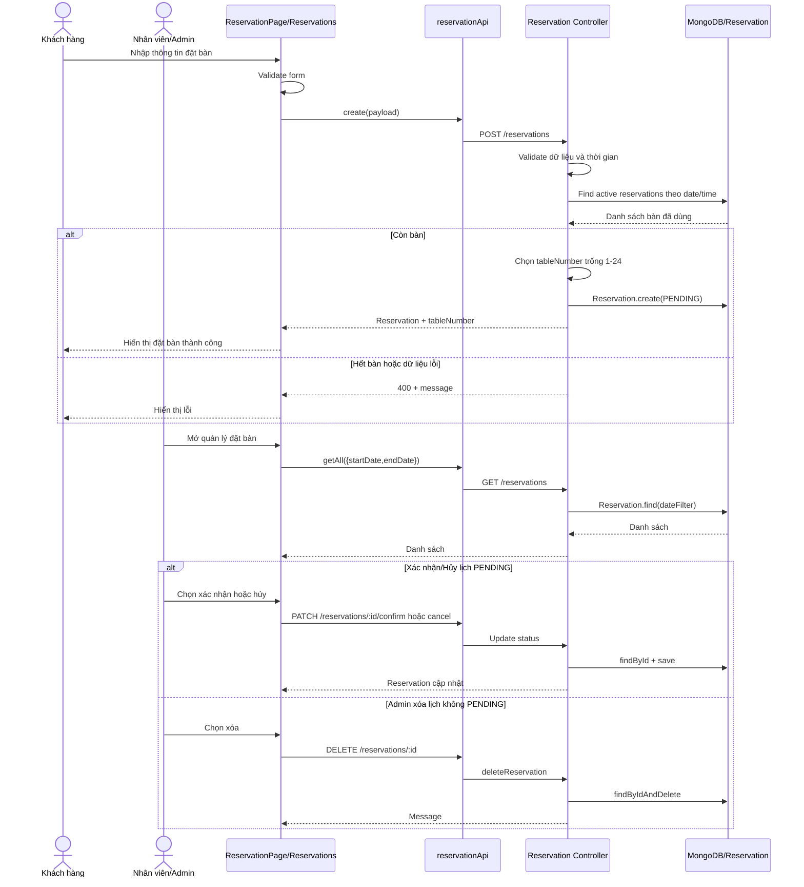
```mermaid
sequenceDiagram
  actor Customer as Khách hàng
  actor Staff as Nhân viên/Admin
  participant FE as ReservationPage/Reservations
  participant API as reservationApi
  participant Ctrl as Reservation Controller
  participant DB as MongoDB/Reservation
  Customer->>FE: Nhập thông tin đặt bàn
  FE->>FE: Validate form
  FE->>API: create(payload)
  API->>Ctrl: POST /reservations
  Ctrl->>Ctrl: Validate dữ liệu và thời gian
  Ctrl->>DB: Find active reservations theo date/time
  DB-->>Ctrl: Danh sách bàn đã dùng
  alt Còn bàn
    Ctrl->>Ctrl: Chọn tableNumber trống 1-24
    Ctrl->>DB: Reservation.create(PENDING)
    Ctrl-->>FE: Reservation + tableNumber
    FE-->>Customer: Hiển thị đặt bàn thành công
  else Hết bàn hoặc dữ liệu lỗi
    Ctrl-->>FE: 400 + message
    FE-->>Customer: Hiển thị lỗi
  end
  Staff->>FE: Mở quản lý đặt bàn
  FE->>API: getAll({startDate,endDate})
  API->>Ctrl: GET /reservations
  Ctrl->>DB: Reservation.find(dateFilter)
  DB-->>Ctrl: Danh sách
  Ctrl-->>FE: Danh sách
  alt Xác nhận/Hủy lịch PENDING
    Staff->>FE: Chọn xác nhận hoặc hủy
    FE->>API: PATCH /reservations/:id/confirm hoặc cancel
    API->>Ctrl: Update status
    Ctrl->>DB: findById + save
    Ctrl-->>FE: Reservation cập nhật
  else Admin xóa lịch không PENDING
    Staff->>FE: Chọn xóa
    FE->>API: DELETE /reservations/:id
    API->>Ctrl: deleteReservation
    Ctrl->>DB: findByIdAndDelete
    Ctrl-->>FE: Message
  end
```

## 3.3.12. Chức năng quản lý người dùng

### Biểu đồ UseCase chức năng quản lý người dùng

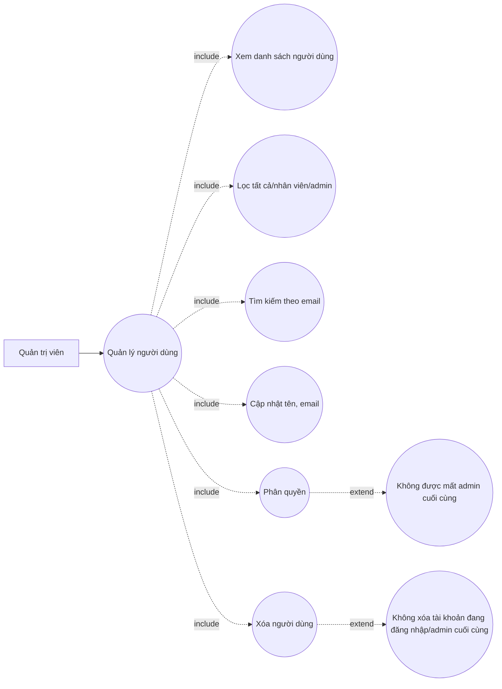
```mermaid
flowchart LR
  Admin[Quản trị viên] --> UC((Quản lý người dùng))
  UC -. include .-> Xem((Xem danh sách người dùng))
  UC -. include .-> Loc((Lọc tất cả/nhân viên/admin))
  UC -. include .-> Tim((Tìm kiếm theo email))
  UC -. include .-> Sua((Cập nhật tên, email))
  UC -. include .-> PhanQuyen((Phân quyền))
  UC -. include .-> Xoa((Xóa người dùng))
  PhanQuyen -. extend .-> GiuAdmin((Không được mất admin cuối cùng))
  Xoa -. extend .-> ChanXoa((Không xóa tài khoản đang đăng nhập/admin cuối cùng))
```

### Bảng đặc tả UseCase quản lý người dùng

| UC | Quản lý người dùng |
|---|---|
| Tác nhân | Quản trị viên |
| Mô tả | Admin xem danh sách người dùng, lọc theo tất cả/nhân viên/admin, tìm theo email, cập nhật tên/email, phân quyền `customer`, `manager`, `admin` và xóa người dùng. |
| Tiền điều kiện | Admin đã đăng nhập; token hợp lệ; request qua middleware `isAdmin`. |
| Hậu điều kiện thành công | Thông tin người dùng, vai trò hoặc danh sách người dùng được cập nhật trên MongoDB và frontend. |
| Hậu điều kiện lỗi | Không cập nhật nếu tên/email trống, email sai định dạng, email trùng, role không hợp lệ, không tìm thấy user. Không đổi/xóa admin cuối cùng và không xóa tài khoản đang đăng nhập. |

### Đặc tả chức năng

| Luồng | Nội dung |
|---|---|
| Luồng chính | 1. Admin mở trang Quản lý người dùng. |
|  | 2. Frontend gọi `GET /users`, `GET /users/role/manager` hoặc `GET /users/role/admin` theo bộ lọc. |
|  | 3. Backend trả danh sách user và loại bỏ trường password. |
|  | 4. Admin tìm kiếm theo email nếu cần. |
|  | 5. Admin chọn sửa thông tin hoặc phân quyền. |
|  | 6. Frontend mở modal và gửi `PUT /users/:id` hoặc `PATCH /users/:id`. |
|  | 7. Backend kiểm tra dữ liệu, email trùng hoặc role hợp lệ. |
|  | 8. Backend cập nhật user và trả user không chứa password. |
|  | 9. Frontend cập nhật danh sách và thông báo thành công. |
| Luồng xóa | 1. Admin bấm xóa người dùng và xác nhận. |
|  | 2. Frontend gọi `DELETE /users/:id`. |
|  | 3. Backend kiểm tra không xóa chính tài khoản đang đăng nhập. |
|  | 4. Backend kiểm tra không xóa admin cuối cùng. |
|  | 5. Backend xóa user và frontend loại user khỏi danh sách. |
| Luồng phụ | 1. Nếu email đã được dùng bởi user khác, backend trả lỗi. |
|  | 2. Nếu role không thuộc `customer`, `manager`, `admin`, backend trả lỗi. |
|  | 3. Nếu chỉ còn một admin, backend không cho đổi role hoặc xóa admin đó. |

### Biểu đồ hoạt động chức năng quản lý người dùng

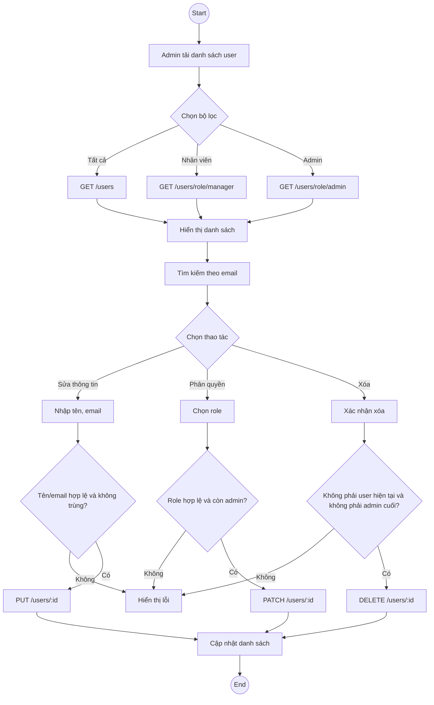
```mermaid
flowchart TB
  Start((Start)) --> Load[Admin tải danh sách user]
  Load --> Filter{Chọn bộ lọc}
  Filter -- Tất cả --> All[GET /users]
  Filter -- Nhân viên --> Manager[GET /users/role/manager]
  Filter -- Admin --> Admins[GET /users/role/admin]
  All --> List[Hiển thị danh sách]
  Manager --> List
  Admins --> List
  List --> Search[Tìm kiếm theo email]
  Search --> Action{Chọn thao tác}
  Action -- Sửa thông tin --> Edit[Nhập tên, email]
  Edit --> CheckInfo{Tên/email hợp lệ và không trùng?}
  CheckInfo -- Không --> Err[Hiển thị lỗi]
  CheckInfo -- Có --> SaveInfo[PUT /users/:id]
  Action -- Phân quyền --> Role[Chọn role]
  Role --> CheckRole{Role hợp lệ và còn admin?}
  CheckRole -- Không --> Err
  CheckRole -- Có --> SaveRole[PATCH /users/:id]
  Action -- Xóa --> Confirm[Xác nhận xóa]
  Confirm --> CheckDelete{Không phải user hiện tại và không phải admin cuối?}
  CheckDelete -- Không --> Err
  CheckDelete -- Có --> Delete[DELETE /users/:id]
  SaveInfo --> Update[Cập nhật danh sách]
  SaveRole --> Update
  Delete --> Update
  Update --> End((End))
```

### Biểu đồ tuần tự chức năng quản lý người dùng

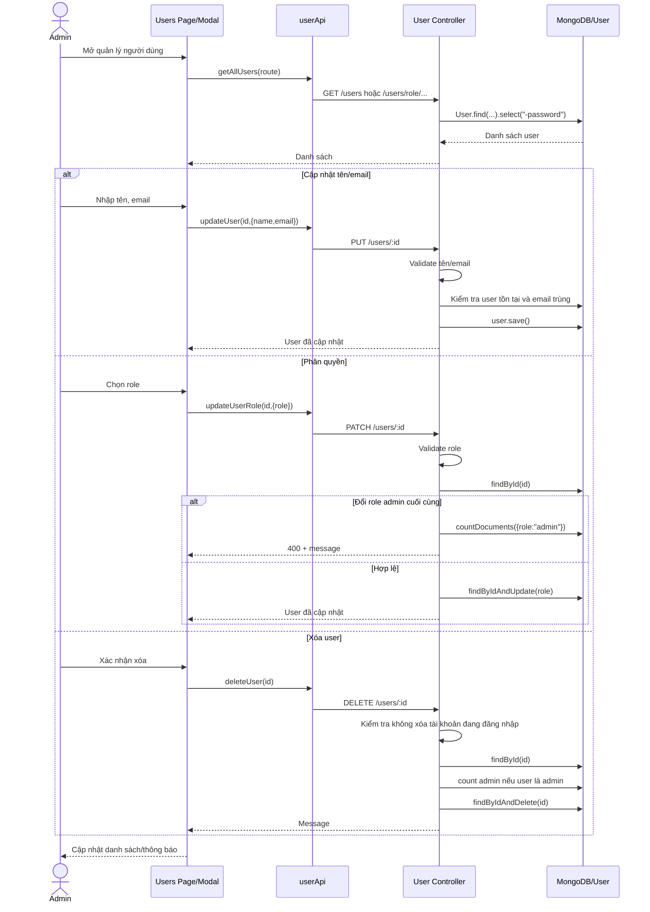
```mermaid
sequenceDiagram
  actor Admin as Admin
  participant FE as Users Page/Modal
  participant API as userApi
  participant Ctrl as User Controller
  participant DB as MongoDB/User
  Admin->>FE: Mở quản lý người dùng
  FE->>API: getAllUsers(route)
  API->>Ctrl: GET /users hoặc /users/role/...
  Ctrl->>DB: User.find(...).select("-password")
  DB-->>Ctrl: Danh sách user
  Ctrl-->>FE: Danh sách
  alt Cập nhật tên/email
    Admin->>FE: Nhập tên, email
    FE->>API: updateUser(id,{name,email})
    API->>Ctrl: PUT /users/:id
    Ctrl->>Ctrl: Validate tên/email
    Ctrl->>DB: Kiểm tra user tồn tại và email trùng
    Ctrl->>DB: user.save()
    Ctrl-->>FE: User đã cập nhật
  else Phân quyền
    Admin->>FE: Chọn role
    FE->>API: updateUserRole(id,{role})
    API->>Ctrl: PATCH /users/:id
    Ctrl->>Ctrl: Validate role
    Ctrl->>DB: findById(id)
    alt Đổi role admin cuối cùng
      Ctrl->>DB: countDocuments({role:"admin"})
      Ctrl-->>FE: 400 + message
    else Hợp lệ
      Ctrl->>DB: findByIdAndUpdate(role)
      Ctrl-->>FE: User đã cập nhật
    end
  else Xóa user
    Admin->>FE: Xác nhận xóa
    FE->>API: deleteUser(id)
    API->>Ctrl: DELETE /users/:id
    Ctrl->>Ctrl: Kiểm tra không xóa tài khoản đang đăng nhập
    Ctrl->>DB: findById(id)
    Ctrl->>DB: count admin nếu user là admin
    Ctrl->>DB: findByIdAndDelete(id)
    Ctrl-->>FE: Message
  end
  FE-->>Admin: Cập nhật danh sách/thông báo
```
